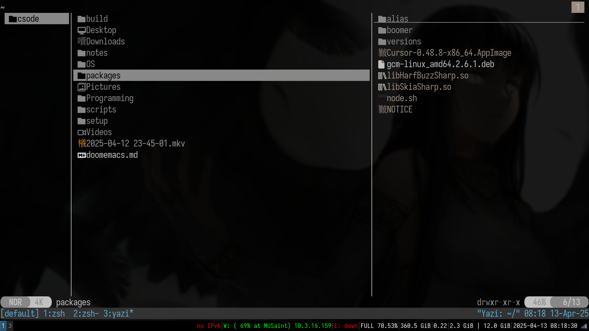
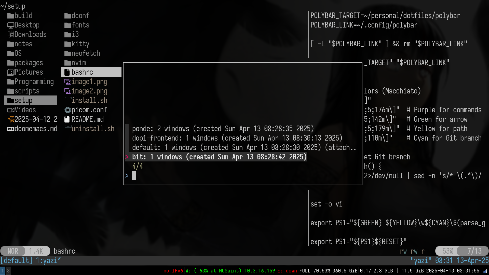
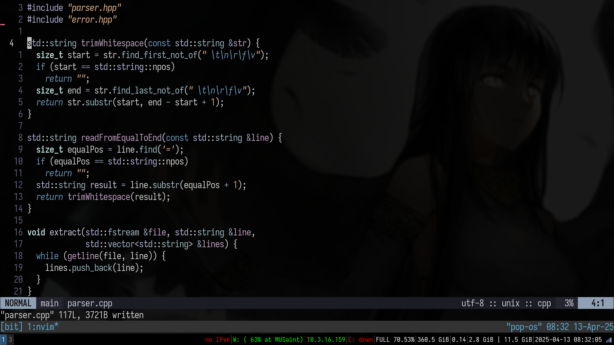

# My DEV Environment 

## Usage

- **OS**: [PopOs](https://system76.com/pop/) – I love its minimalism and the powerful package manager.
- **Window Manager**: [i3-wm](https://i3wm.org/) – I prefer tiling window managers, and no, I'm not switching to Wayland!
- **Editor**: [Neovim](https://neovim.io/) – A better version of Vim—why not use it?
- **Shell**: [Bash](https://www.gnu.org/software/bash/) – I enjoy using my own theme.
- **Terminal Multiplexer**: [tmux](https://github.com/tmux/tmux/wiki) – My favorite terminal multiplexer.

## Add-ons

1. **Dmenu** – Application launcher
2. **Polybar** – Customizable status bar
3. **Kitty** – Terminal emulator

## Installation

I've included a `packages.sh` script that simplifies the installation of what I consider essential tools for programming and general use.

### Installed Applications:

- `git`
- `base-devel`
- `fzf`
- `xorg-xrandr`
- `feh`
- `rofi`
- `polybar`
- `neovim`
- `neofetch`
- `kitty`
- `gimp`
- `tmux`
- `firefox`
- `i3-wm`

## Pictures :





## How to build :
I have included scripts on how to install and uninstall so follow the guide from the script.

### Step 1 :
```sh
git clone https://github.com/csode/setup.git
```
### Step 2 : 
- If u want to install both packages and the dotfiles 
```sh
./packages.sh
./install.sh
```
- Else
```sh
./install.sh
```
### Step 3 :
Your are done

## How to uninstall :
- If u want to remove  the dotfiles 
```sh
./uninstall.sh
```
